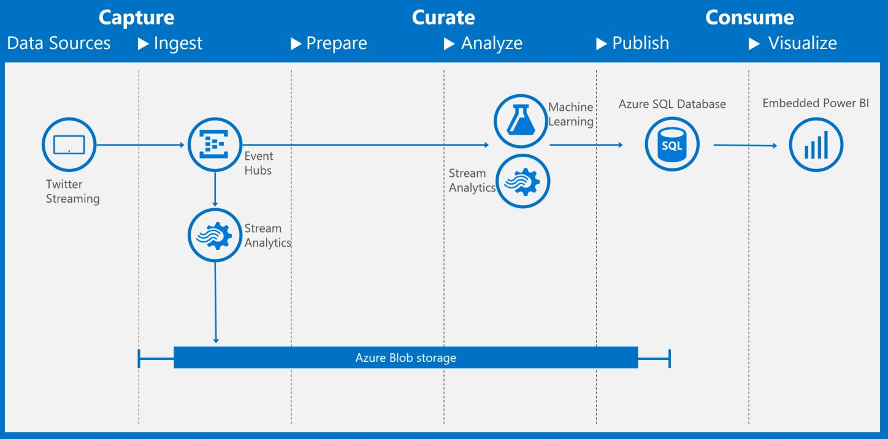

# CIQS Solution Authoring Guide for Cortana Intelligence Solutions

  * Based on a document started by Sharath Malladi sharathm@microsoft.com 
  * Modified by Darwin Schweitzer darsch@microsoft.com 
  * Last updated on 02/10/2017 by Darwin Schweitzer

[What Is CIQS](#WhatIsCIQS)

[What is a CIQS pattern/solution](#Pattern)

[Where can CIQS patterns be authored?](#Authored)

[Next2](#PostDeployment)

[Next2](#customization)

[Next3](#visualization)

[Next4](#security)

#What Is CIQS
  * CIQS (Cortana Intelligence Quick Start) is a framework/place to host Azure patterns to create Cortana Intelligence Solutions.  It was formerly known as CAQS.

#What is a CIQS pattern/solution
  * A CIQS pattern consists of ARM templates, webjobs, functions, markdown files, and a Manifest.xml. We sometimes refer to all these three with the generic name of ‘task’ below in this document. Publicly available patterns are located at [Cortana Intelligence Gallery](https://gallery.cortanaintelligence.com/solutions).
  * For Custom Solutions which are also referred to as private patterns (i.e. when authoring a pattern), refer to the section on Solution Authoring Workspace (SAW) in this document.

Here is an example of a solution or tutorial that can be authored with SAW.  This architecture demonstrates how to capture, curate, and consume tweets from the Twitter streaming API.  You enter keywords and your oauth tokens to capture tweets, calculate a sentiment score, and then consume the output in embedded Power BI.

#Where can CIQS patterns be authored?
  * CIQS patterns can currently be authored by navigating to [Deployments](https://start.cortanaintelligence.com/Deployments) and clicking on CUSTOM SOLUTIONS on the Top menu bar.   This authoring capability is currently available to microsoft.com users and selected partners on the allow list (vs deny list) to access the capability.  If you don't see the CUSTOM SOLUTIONS menu item you are not on the allow list.  Please contact Cortana Intelligence Solutions [cisolutions@microsoft.com](<mailto:cisolutions@microsoft.com>) with your justification if you would like access to this feature.  

# Post Deployment Guidance

## Customization
* More descriptions about customization.

## Enhancing Visualization
* More descriptions about enhancing visualization.

## Security
* More descriptions about security.