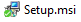
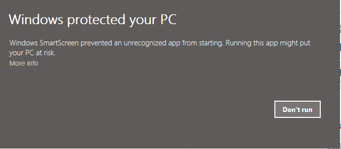
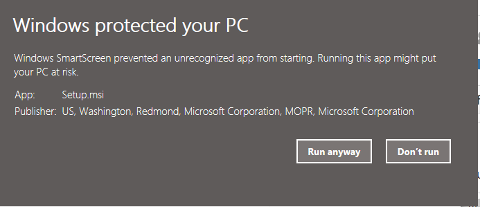
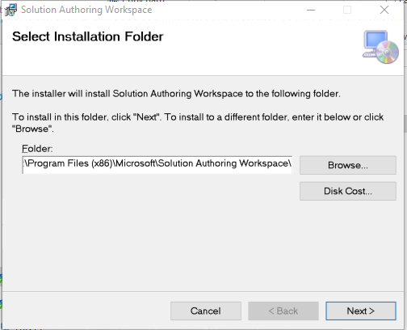
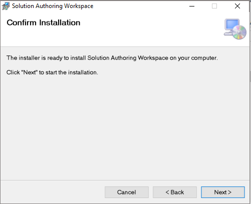
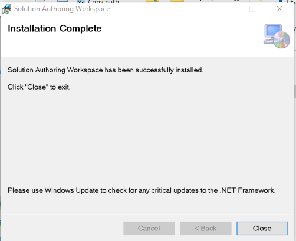
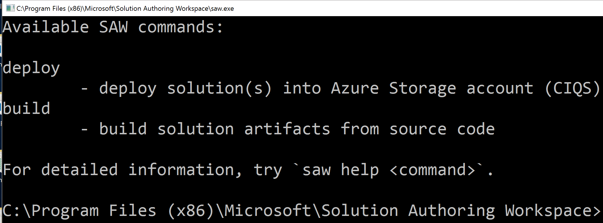
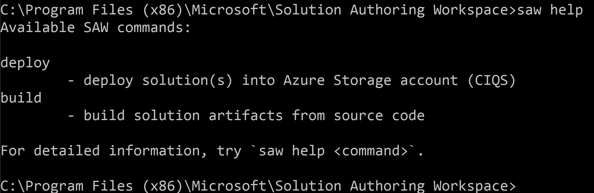
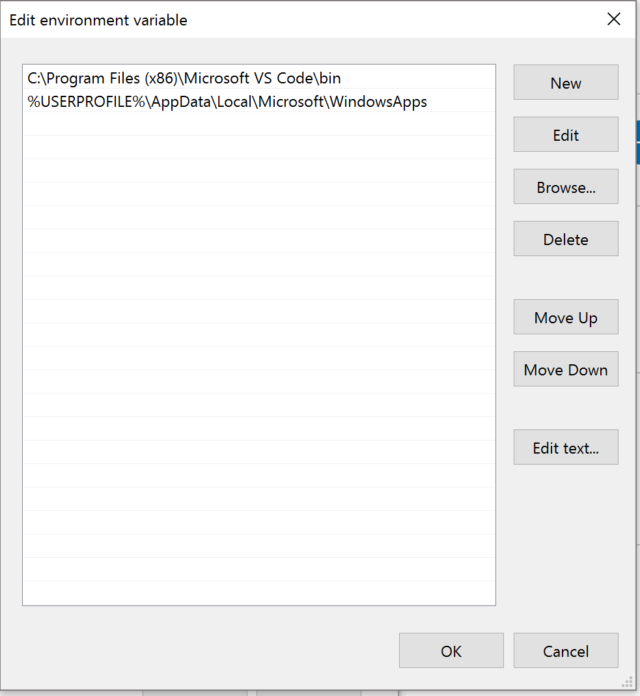
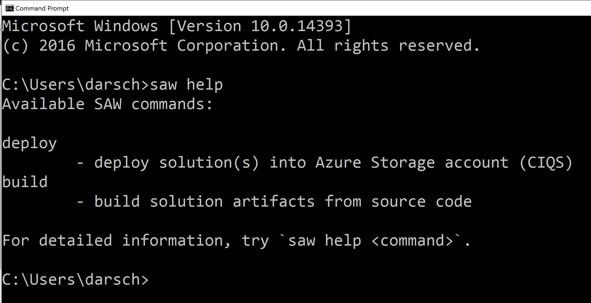

# CIQS Solution Authoring Guide for Cortana Intelligence Solutions

  * Based on a document started by Sharath Malladi sharathm@microsoft.com 
  * Modified by Darwin Schweitzer darsch@microsoft.com 
  * Last updated on 02/13/2017 by Darwin Schweitzer

[What Is CIQS](#WhatIsCIQS)

[What is a CIQS pattern/solution](#Pattern)

[Where can CIQS patterns be authored?](#Authored)

[How to Install SAW](#InstallSAW)

[Start Authoring using Solution Authoring Workspace (SAW)](#Start)

[Next3](#visualization)

[Next4](#security)

#What Is CIQS
  * CIQS (Cortana Intelligence Quick Start) is a framework/place to host Azure patterns to create Cortana Intelligence Solutions.  It was formerly known as CAQS.

#What is a CIQS pattern/solution
  * A CIQS pattern consists of ARM templates, webjobs, functions, markdown files, and a Manifest.xml. We sometimes refer to all these three with the generic name of ‘task’ below in this document. Publicly available patterns are located at [Cortana Intelligence Gallery](https://gallery.cortanaintelligence.com/solutions).
  * For Custom Solutions which are also referred to as private patterns (i.e. when authoring a pattern), refer to the section on [Start Authoring using Solution Authoring Workspace (SAW)](#Start) in this document.

Here is an example of a solution or tutorial that can be authored with SAW.  This architecture demonstrates how to capture, curate, and consume tweets from the Twitter streaming API.  You enter keywords and your oauth tokens to capture tweets, calculate a sentiment score, and then consume the output in embedded Power BI.

#Where can CIQS patterns be authored?
  * CIQS patterns can currently be authored by navigating to [Deployments](https://start.cortanaintelligence.com/Deployments) and clicking on CUSTOM SOLUTIONS on the Top menu bar.   This authoring capability is currently available to microsoft.com users and selected partners on the allow list (vs deny list) to access the capability.  If you don't see the CUSTOM SOLUTIONS menu item you are not on the allow list.  Please contact Cortana Intelligence Solutions [cisolutions@microsoft.com](<mailto:cisolutions@microsoft.com>) with your justification if you would like access to this feature.  

# How to Install SAW

  * Download and Install the SAW setup.msi (Note SAW setup.msi can only be installed on windows currently, but VS Code also runs on Mac and Linux)

  * Double click on  

    The MSI is currently unsigned so you might get this message.  To Run the MSI click on **More info**
    

  * Click on the **Run anyway** button
    

  * Select Installation Folder and click **Next**.  The default is C:\Program Files (x86)\Microsoft\Solution Authoring Workspace\
    

  * To Confirm Installation click **Next**  
    

    Missed a Screen Here since it can’t be capture.   
    Get a dialog that says:  
    Do you want to allow this app to make changes to your device?  
    Click **Yes**

  * The Installation is complete so click **Close**  
    

  * This will add a **SAW Shell** shortcut to your desktop  
    

  * Double click on SAW Shell  
    

  * To see if SAW is working enter **saw help**  
    

  * SAW will now work to deploy solutions authored in any code editor

  * If you will want to run SAW from the command prompt and in the Visual Studio Code Terminal you need to add the path to SAW (**C:\Program Files (x86)\Microsoft\Solution Authoring Workspace**) to the Environment Variables in your Path in User Variables.
    You also need to add the path to MSBuild (**C:\Program Files (x86)\MSBuild\14.0\Bin**)
    
    Navigate to **Control Panel\System and Security\System** and click on **Advanced system settings**
    

  * Click on **Environment Variables** 
    

  * Click on the Path variable under User variables and click on the **Edit** button
    

  * Click on the **New** button and add the following path for SAW

    `` C:\Program Files (x86)\Microsoft\Solution Authoring Workspace``

	  Click on the **New** button and add the following path for MSBuild
    
    ``C:\Program Files (x86)\MSBuild\14.0\Bin``

    

  * Then click the **OK** button  
    

  * Open a Command Prompt and enter ``saw help``
  
    You should see the same info as you noticed in SAW Shell
    

  * Using either the SAW Shell shortcut on your desktop or the command prompt you just successfully used and tested ``saw help``
    enter ``saw configure``
    

## Start Authoring using Solution Authoring Workspace (SAW)
* More descriptions about customization.

## Enhancing Visualization
* More descriptions about enhancing visualization.

## Security
* More descriptions about security.