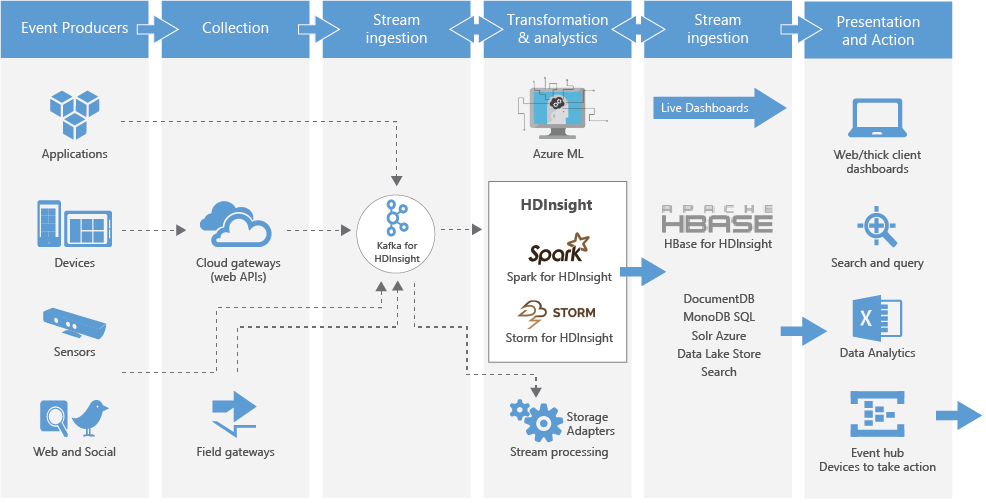

### Welcome to the Microsoft Cortana Intelligence Solution Template - Time Series Insights using Twitter

## Architecure

This Tutorial demonstrates how to use Spark with Kafka (preview) on HDInsight

While you can create an Azure virtual network, Kafka, and Spark clusters manually, it's easier to use a Cortana Intelligence Solution Template which deploys the clusters using an Azure Resource Manager template and Azure Functions. 
Use the following steps to deploy an Azure virtual network, Kafka, and Spark clusters to your Azure subscription.

The tutorial involves the following steps:

1. Deploy the Spark with Kafka (preview) on HDInsight tutorial which creates the following resources:
	* Kafka on HDInsight 3.5 cluster
	* Spark on HDInsight 3.6 cluster
	* Azure Virtual Network, which contains the HDInsight clusters
	
2. Learn how to use Spark Structured Streaming to read data from Apache Kafka on Azure HDInsight.
Spark structured streaming is a stream processing engine built on Spark SQL. It allows you to express streaming computations the same as batch computation on static data. For more information on Structured Streaming, see the Structured Streaming Programming Guide [Alpha] at Apache.org.

	[Use Spark Structured Streaming with Kafka (preview) on HDInsight](https://docs.microsoft.com/en-us/azure/hdinsight/hdinsight-apache-kafka-spark-structured-streaming#get-the-kafka-brokers)

3. Learn how to use Spark Apache Spark to stream data into or out of Apache Kafka on HDInsight using DStreams. This example uses a Jupyter notebook that runs on the Spark cluster.

	[Apache Spark streaming (DStream) example with Kafka (preview) on HDInsight](https://docs.microsoft.com/en-us/azure/hdinsight/hdinsight-apache-spark-with-kafka#a-idkafkahostsakafka-host-information)

[Apache Hadoop®](http://hadoop.apache.org/) and associated open source project names are trademarks of [The Apache Software Foundation](http://apache.org/).
