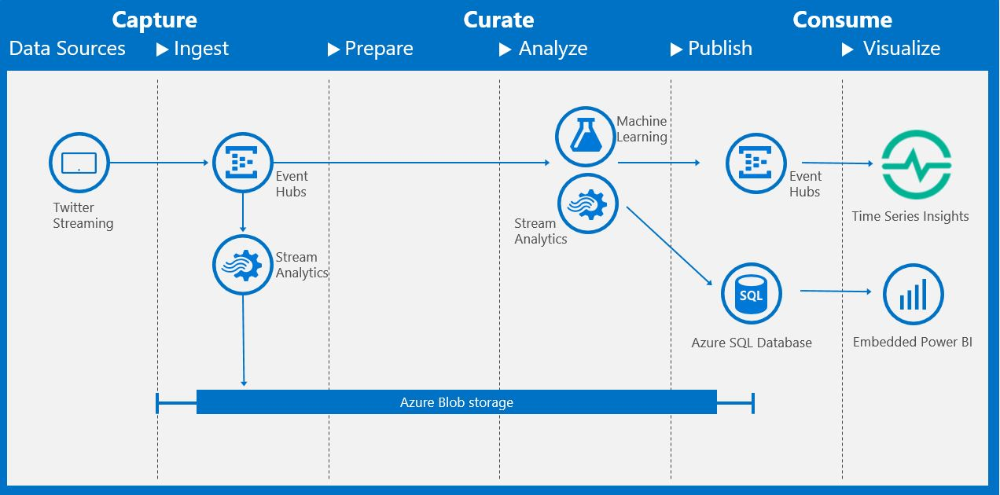

### Welcome to the Microsoft Cortana Intelligence Solution Template - Time Series Insights using Twitter

This solution sets up the infrastructure in the diagram above. The various steps are as follows:

* Setting up an Azure WebJob to collect Twitter data based on user specified keywords.
* Pumping ingested tweets into Azure Event Hub which can accept millions of events per second.
* Processing incoming tweets with an Azure Stream Analytics job that stores the raw data in Azure Blob Storage and Azure SQL Database.
* The Stream Analytics job calls an Azure Machine Learning web service to determine the sentiment of each tweet. 
* Visualizing real-time metrics about inferred sentiment using Time Series Insights for Operational Technology real-time monitoring and Power BI for Information Technology reporting and analysis.

## Video

[Video](https://channel9.msdn.com/Shows/Cortana-Intelligence-Corner/Twitter-Sentiment-Analysis-using-the-Cortana-Intelligence-Gallery) on how to do use this Solution Template to do Twitter Sentiment Analysis using the Cortana Intelligence Gallery by Chris Testa-O'Neill

## Prerequisites

To run the TwitterClient web job, you will need:

1. A [Twitter account](https://twitter.com/login)
2. A [Twitter application](https://apps.twitter.com)
3. Twitter's Streaming API OAuth credentials
  - On the Twitter application page, click on the *Keys and Access Tokens* tab
  - *Consumer Key (API Key)* and *Consumer Secret (API Secret)* can be found under **Application Settings** section
  - Under **Your Access Token** section, click on *Create my access token* to obtain both *Access Token* and *Access Token Secret*

More details on Twitter's Streaming API OAuth access token can be found [here](https://dev.twitter.com/oauth/overview/application-owner-access-tokens).