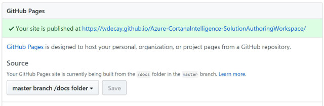
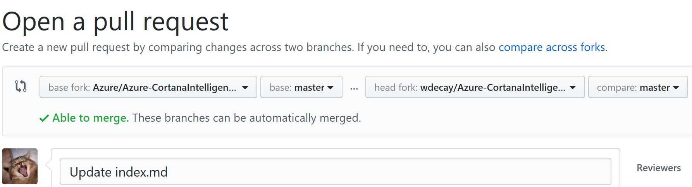
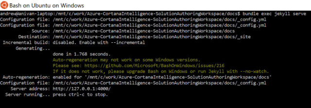

# How to contribute

## Background
The documentation is hosted on [GitHub pages](https://help.github.com/categories/github-pages-basics/) using [Jekyll](https://help.github.com/articles/about-github-pages-and-jekyll/) as a static site generator.

The website automatically created from the sources files found in this directory is available at [https://azure.github.io/Azure-CortanaIntelligence-SolutionAuthoringWorkspace/](https://azure.github.io/Azure-CortanaIntelligence-SolutionAuthoringWorkspace/).

### Documentation pages

Markdown (.md) files in this directory are the main documentation pages. 

### Release notes

SAW/CIQS release notes are the Markdown (.md) files inside the **_posts** directory.

## Contributing

### 1. Fork this repository into your private GitHub account
### 2. Update GitHub Pages repository settings
Set **Source** to **master branch /docs folder**:



This will result in the creation of a private SAW Documentation website (e.g., https://wdecay.github.io/Azure-CortanaIntelligence-SolutionAuthoringWorkspace/).

### 3. Edit existing or add new Markdown files

This can be done either directly on GitHub by using its [rich file management features](https://help.github.com/categories/managing-files-in-a-repository/), or by cloning your private repo and making the changes locally.

Changes pushed into the master branch of your private repo are immediately reflected in the GitHub Pages website created earlier.

### 4. Create a new pull request

Open a new pull request after making sure the updates are correctly rendered on your private documentation website.



Read the official GitHub help page on [creating a pull request from a fork](https://help.github.com/articles/creating-a-pull-request-from-a-fork/) for additional guidance. 

## Advanced editing (running Jekyll locally)

For most contributors, file management and editing features available on GitHub should be sufficient. Some, however, may want to set up a local environment to test their changes. This is particularly useful when modifying the documentation website's layout, which requires editing HTML, SCSS and other files found inside the **_includes**, **_layouts** and **_sass** directories.

GitHub provides instructions on [setting up your GitHub pages site locally with Jekyll](https://help.github.com/articles/setting-up-your-github-pages-site-locally-with-jekyll/). Running Jekyll natively on Windows is possible, but the setup process is rather tedious and poorly documented. The instructions below suggest an alternative approach with a more straight-forward configuration.

### Using *Bash on Ubuntu on Windows* to run Jekyll

#### Prerequisites

1. [Bash on Ubuntu on Windows](https://msdn.microsoft.com/en-us/commandline/wsl/about) running or [upgraded](https://blogs.msdn.microsoft.com/commandline/2016/10/19/wsl-adds-ubuntu-16-04-xenial-support/) to Ubuntu 16.04 (Xenial). Ubuntu 14.04 shipped before the Windows 10 Creators Update will not work!
2. Your private SAW repository cloned to a Windows drive (e.g., **C:\work\Azure-CortanaIntelligence-SolutionAuthoringWorkspace**).


#### Setup

1. Open the *Bash on Ubuntu on Windows* shell and run the following commands:
    ```
    $ sudo apt-get update
    $ sudo apt-get upgrade
    $ sudo apt-get install ruby ruby-dev make g++
    $ sudo gem install bundler
    ```

2. Locate the **Azure-CortanaIntelligence-SolutionAuthoringWorkspace/docs** directory in the Linux filesystem.
    
    Assuming the corresponding Windows location is **C:\work\Azure-CortanaIntelligence-SolutionAuthoringWorkspace\docs**, that can be achieved with the following command:

    ```
    $ cd /mnt/c/work/Azure-CortanaIntelligence-SolutionAuthoringWorkspace/docs
    ```

3. From the **docs** directory in the Bash shell, run:
    ```
    $ bundle install
    ```

Once the steps above are completed, you can launch SAW Documentation website locally from the Bash shell with the  following command:

```
$ bundle exec jekyll serve
```



Edit the website (content and layout) using your favorite editor on Windows. Jekyll will automatically detect the changes you make and regenerate the pages on the fly.

The URL to access the local documentation website is ```http://localhost:4000```.