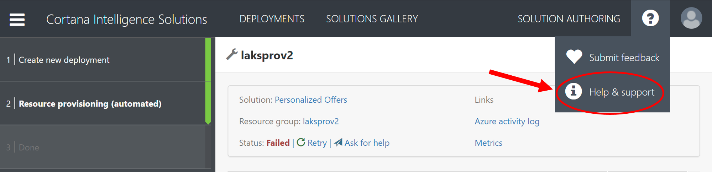

# Frequently Asked Questions
## Common Deployment Failures
This section describes some common CIQS deployment errors you may encounter, and provides information to resolve the errors. For more information on Azure Resource Management (ARM) errors, please see [Troubleshoot common Azure deployment errors with Azure Resource Manager](https://docs.microsoft.com/en-us/azure/azure-resource-manager/resource-manager-common-deployment-errors) for more details.

### ArmValidationFailed
This error code indicates that ARM pre-flight validation fails. ARM pre-flight validation could fail for various reasons: Some of them are actionable/retriable, such as [quota exceeded](#how-to-request-quota-increase); Some of them are non-recoverable; in this case, please [contact Azure support](#how-to-submit-azure-support-request) or [contact CIQS support](#how-to-contact-ciqs-support).

| Error code | Detailed message | Mitigation or resolution |
| -------- | ------------ | ------------- |
| *QuotaExceeded* | *Operation results in exceeding quota limits of Core. Maximum allowed: 100, Current in use: 86, Additional requested: 18. Please read more about quota increase at http://aka.ms/corequotaincrease.* | <ul><li>If you are aware of the service type, you can delete some unused service from the Azure portal to release some quota</li><li>If you would like to increase the quota, you can follow the instructions to [request quota increase](#how-to-request-quota-increase). Once the quota is increased, you can [retry the provisioning step](#how-to-retry-a-failed-provisioning-step)</li><li>If the problem persists, please [contact CIQS support](#how-to-contact-ciqs-support)</li></ul> |
| *BadRequest* | *Operation results in exceeding quota limits of Core. Maximum allowed: 20, Current in use: 8, Additional requested: 16.* | <ul><li>If you are aware of the service type, you can delete some unused service from Azure portal to release some quota</li><li>If you would like to increase the quota, you can follow the instructions to [request quota increase](#how-to-request-quota-increase). Once the quota is increased, you can [retry the provisioning step](#how-to-retry-a-failed-provisioning-step)</li><li>If the problem persists, please [contact CIQS support](#how-to-contact-ciqs-support)</li></ul> |
| *DisallowedProvider* | *The operation is not permitted for namespace 'Microsoft.Storage'. List of permitted provider namespaces is 'Microsoft.Authorization, Microsoft.Features, Microsoft.insights, Microsoft.NotificationHubs, Microsoft.Resources, Microsoft.Sql'* | <ul><li>This error indicates that your subscription does not have access to the resource 'Microsoft.Storage', or you do not have permission to register 'Microsoft.Storage'. In this case you can ask the subscription admin to register the resource to unblock your deployment</li><li>You can also go to Azure portal (portal.azure.com) -> Subscriptions -> select the subscription -> Resource providers -> Microsoft.Storage to manually register. Once the resource provider is registered, you can [retry the provisioning step](#how-to-retry-a-failed-provisioning-step)</li></ul> |

For errors not listed in the table, please [contact CIQS support](#how-to-contact-ciqs-support) for help.

### Conflict

| Common error message | Mitigation or resolution |
| ------------ | ------------- |
| The maximum number of Free ServerFarms allowed in a Subscription is 10. | <ul><li>If you are aware of the service type, you can delete some unused service from Azure portal to release some quota</li><li>If you would like to increase the quota, you can follow the instructions to [request quota increase](#how-to-request-quota-increase). Once the quota is increased, you can [retry the provisioning step](#how-to-retry-a-failed-provisioning-step)</li><li>If the problem persists, please [contact CIQS support](#how-to-contact-ciqs-support)</li></ul> |
| *Not enough available reserved instance servers to satisfy this request. Currently 0 instances are available.* | <ul><li>If you are aware of the service type, you can delete some unused service from Azure portal to release some quota</li><li>If you would like to increase the quota, you can follow the instructions to [request quota increase](#how-to-request-quota-increase). Once the quota is increased, you can [retry the provisioning step](#how-to-retry-a-failed-provisioning-step)</li><li>If the problem persists, please [contact CIQS support](#how-to-contact-ciqs-support)</li></ul> |

For errors not listed in the table, please [contact CIQS support](#how-to-contact-ciqs-support) for help.

### BadRequest

| Common error message | Mitigation or resolution |
| ------------ | ------------- |
| *User SubscriptionId 'abcd1234-ef56-ghijklm78901' does not have cores left to create resource 'spark-cluster'. Required: 32, Available: 28.* | <ul><li>If you would like to increase the quota, you can follow the instructions to [request quota increase](#how-to-request-quota-increase). Once the quota is increased, you can [retry the provisioning step](#how-to-retry-a-failed-provisioning-step)</li><li>If the problem persists, please [contact CIQS support](#how-to-contact-ciqs-support)</li></ul> |
| *The region is not enabled for this subscription, please contact support for more information.* | <ul><li>[Contact Azure support](#how-to-submit-azure-support-request)</li><li>[Contact your subscription admin](#how-to-contact-subscription-admin)</li></ul> |
| *RegionCapabilityNotAvailable, Region capability not available for region 'West Central US' and Subscription ID 'abcd1234-ef56-ghijklm78901'. (Code: BadRequest, ResourceType: Microsoft.HDInsight/clusters, ResourceName: hdicluster)* | <ul><li>This is a similar issue to [SkuNotAvailable](#skunotavailable), in which case the underlying compute sku is not available for some region in that subscription</li></ul> |

For errors not listed in the table, please [contact CIQS support](#how-to-contact-ciqs-support) for help.

### ExceededMaxAccountCount

| Common error message | Mitigation or resolution |
| ------------ | ------------- |
| *The maximum number of Free ServerFarms allowed in a Subscription is 10.* | <ul><li>If you are aware of the service type, you can delete some unused service from Azure portal to release some quota</li><li>If you would like to increase the quota, you can follow the instructions to [request quota increase](#how-to-request-quota-increase). Once the quota is increased, you can [retry the provisioning step](#how-to-retry-a-failed-provisioning-step)</li><li>If the problem persists, please [contact CIQS support](#how-to-contact-ciqs-support)</li></ul> |

For errors not listed in the table, please [contact CIQS support](#how-to-contact-ciqs-support) for help.

### MaxOnDemandHdiCoresReached

| Common error message | Mitigation or resolution |
| ------------ | ------------- |
| *Unable to create or update an on-demand HDInsight cluster with 12 cores for subscription abcd1234-ef56-ghijklm78901. The Azure Data Factory quota for on-demand HDInsight cores for this subscription is 40, whereas 36 are currently reserved. If you would like to increase this quota, create a new Azure support request with issue type 'Quota' and quota type 'Data Factory'.* | <ul><li>You can  delete some unused <a href="https://ms.portal.azure.com/#blade/HubsExtension/Resources/resourceType/Microsoft.DataFactory%2FdataFactories" target="_blank">linked services</a> that use on-demand HDI clusters, to release some quota</li><li>If you would like to increase the quota, create a new Azure support request with issue type 'Quota' and quota type 'Data Factory'. Learn more about [how to resolve quota issues here](#how-to-request-quota-increase). Once the quota is increased, you can [retry the provisioning step](#how-to-retry-a-failed-provisioning-step)</li></ul> |

For errors not listed in the table, please [contact CIQS support](#how-to-contact-ciqs-support) for help.

### SubscriptionQuotaExceeded

| Common error message | Mitigation or resolution |
| ------------ | ------------- |
| *The regional account quota for the specified subscription has been reached. (Code: SubscriptionQuotaExceeded, ResourceType: Microsoft.Batch/batchAccounts, ResourceName: batchname)* | <ul><li>If you are aware of the service type, you can delete some unused service from Azure portal to release some quota</li><li>You can follow the instructions to [request quota increase](#how-to-request-quota-increase). Once the quota is increased, you can [retry the provisioning step](#how-to-retry-a-failed-provisioning-step)</li><li>If the problem persists, please [contact CIQS support](#how-to-contact-ciqs-support)</li></ul> |

For errors not listed in the table, please [contact CIQS support](#how-to-contact-ciqs-support) for help.

### OperationNotAllowed

| Common error message | Mitigation or resolution |
| ------------ | ------------- |
| *Operation results in exceeding quota limits of Core. Maximum allowed: 4, Current in use: 0, Additional requested: 8.* | <ul><li>If you are aware of the service type, you can delete some unused service from Azure portal to release some quota</li><li>If you would like to increase the quota, you can follow the instructions to [request quota increase](#how-to-request-quota-increase). Once the quota is increased, you can [retry the provisioning step](#how-to-retry-a-failed-provisioning-step)</li><li>If the problem persists, please [contact CIQS support](#how-to-contact-ciqs-support)</li></ul> |

For errors not listed in the table, please [contact CIQS support](#how-to-contact-ciqs-support) for help.

### MissingRegistrationForLocation

| Common error message | Mitigation or resolution |
| ------------ | ------------- |
| *The subscription is not registered for the resource type 'components' in the location 'brazilsouth'. Please re-register for this provider in order to have access to this location. (Code: MissingRegistrationForLocation)* | <ul><li>[Register Azure resource provider manually](#how-to-register-azure-resource-provider)</li><li>[Contact Azure support](#how-to-submit-azure-support-request)</li><li>[Contact your subscription admin](#how-to-contact-subscription-admin)</li></ul> |

### SkuNotAvailable

| Common error message | Mitigation or resolution |
| ------------ | ------------- |
| *The requested tier for resource 'resourcePath' is currently not available in location 'westus' for subscription 'abcd1234-ef56-ghijklm78901'. Please try another tier or deploy to a different location. (Code: SkuNotAvailable, ResourceType: Microsoft.Compute/virtualMachines, ResourceName: resourceName)* | <ul><li>Use [Azure CLI](https://docs.microsoft.com/en-us/cli/azure/overview?view=azure-cli-latest) command `az vm image --all` to check regional availability for your subscription</li><li>Redeploy the solution with another tier or in another region</li><li>If the problem persists, please [contact CIQS support](#how-to-contact-ciqs-support)</li></ul> |

### Provisioning timeout
| Error code | Detailed message | Mitigation or resolution |
| -------- | ------------ | ------------- |
| *OSProvisioningTimedOut* | *Deployment abcd1234-ef56-ghijklm78901 failed at becuase of The resource operation completed with terminal provisioning state 'Failed'. (Code: ResourceDeploymentFailure, ResourceType: Microsoft.Compute/virtualMachines, ResourceName: dsvmsql2)- OS Provisioning for VM 'dsvm' did not finish in the allotted time. The VM may still finish provisioning successfully. Please check provisioning state later. (Code: OSProvisioningTimedOut)* | <ul><li>[Retry the provisioning step](#how-to-retry-a-failed-provisioning-step)</li><li>If the problem persists, please [contact CIQS support](#how-to-contact-ciqs-support)</li></ul> |
| *VMExtensionProvisioningTimeout* | *Provisioning of VM extension 'Microsoft.EnterpriseCloud.Monitoring' has timed out. Extension installation may be taking too long, or extension status could not be obtained.* | <ul><li>[Retry the provisioning step](#how-to-retry-a-failed-provisioning-step)</li><li>If the problem persists, please [contact CIQS support](#how-to-contact-ciqs-support)</li></ul> |

For errors not listed in the table, please [contact CIQS support](#how-to-contact-ciqs-support) for help.

### 45120
Code '45120' usually indicates resource naming conflicts. The table lists commonly seen error messages.

| Common error message | Mitigation or resolution |
| ------------ | ------------- |
| *The name 'churn.database.windows.net' already exists. Choose a different name.  (Code: 45120, ResourceType: Microsoft.Sql/servers, ResourceName: churn)* | This usually indicates a solution bug, please [contact CIQS support](#how-to-contact-ciqs-support) for help |
| *Deployment abcd1234-ef56-ghijklm78901 failed at becuase of The name 'servernamesrv' already exists. Choose a different name. (Code: 45120, ResourceType: Microsoft.Sql/servers, ResourceName: servernamesrv).* | <ul><li>From Azure portal (https://portal.azure.com), delete the existing resource 'servernamesrv', and then [retry the provisioning step](#how-to-retry-a-failed-provisioning-step)</li><li>Create a new deployment with a different name</li><li>If the problem persists, please [contact CIQS support](#how-to-contact-ciqs-support)</li></ul> |

For errors not listed in the table, please [contact CIQS support](#how-to-contact-ciqs-support) for help.

### Invalid useruser or password
| Error code | Detailed message | Mitigation or resolution |
| -------- | ------------ | ------------- |
| *15021* | *Invalid value given for parameter Password. Specify a valid parameter value. (Code: 15021, ResourceType: Microsoft.Sql/servers, ResourceName: resourceName)* | [Contact CIQS support](#how-to-contact-ciqs-support) |
| *40616* | *'admin' is not a valid login name in this version of SQL Server.* | [Contact CIQS support](#how-to-contact-ciqs-support) |
| *BadRequest* | *Uppercase characters in cluster username are not allowed for version 3.5.* | [Contact CIQS support](#how-to-contact-ciqs-support) |

For errors not listed in the table, please [contact CIQS support](#how-to-contact-ciqs-support) for help.

### WebJobFailure
TBA

### FunctionFailure
TBA

### How to submit Azure support request?

In Azure portal (https://portal.azure.com), click "Help + support" from the right panel, and then click on "+ New support request". You can find "Help + support" from the question mark on the top right:

Follow instructions to create a support request. Please see a sample instruction in [How to request quota increase](#how-to-request-quota-increase). 

Another example: [Resource Manager vCPU core quota increase requests](https://docs.microsoft.com/en-us/azure/azure-supportability/resource-manager-core-quotas-request)

### How to request quota increase?

An example is available here: [Resource Manager vCPU core quota increase requests](https://docs.microsoft.com/en-us/azure/azure-supportability/resource-manager-core-quotas-request)

In the case of "[**MaxOnDemandHdiCoresReached**](#maxondemandhdicoresreached)", select issue type 'Quota' and quota type 'Data Factory':

Follow instructions and fill in problem descriptions as detailed as possible and attach files if necessary; Finally, click on "Create":

### How to contact CIQS support?

In CIQS gallery home page, you can find "Help & support" from the question mark on the top right.

In deployment detail page, you can find "Ask for help" link upon deployment failures.

Describe your issue as detailed as possible in the email body. Our on-call engineers will be ready to help you once we hear from you.

### How to contact subscription admin?

In Azure portal (https://portal.azure.com), click "Subscriptions" from the right panel and select your target subscription, and then click on "Access Control(IAM)". From there you will see contact info of the administrator(s) for that subscription.

### How to register Azure resource provider?

TBA

### How to retry a failed provisioning step?

Retrying a failed provisioning step is easy. In the deployment failure page, click the "retry" button. Before clicking the "retry" button, make sure that the previous failure is resolved or mitigated, such as [the quota limit has been increased](#how-to-request-quota-increase).

