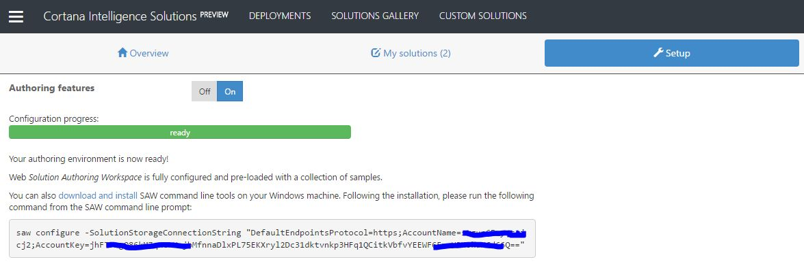
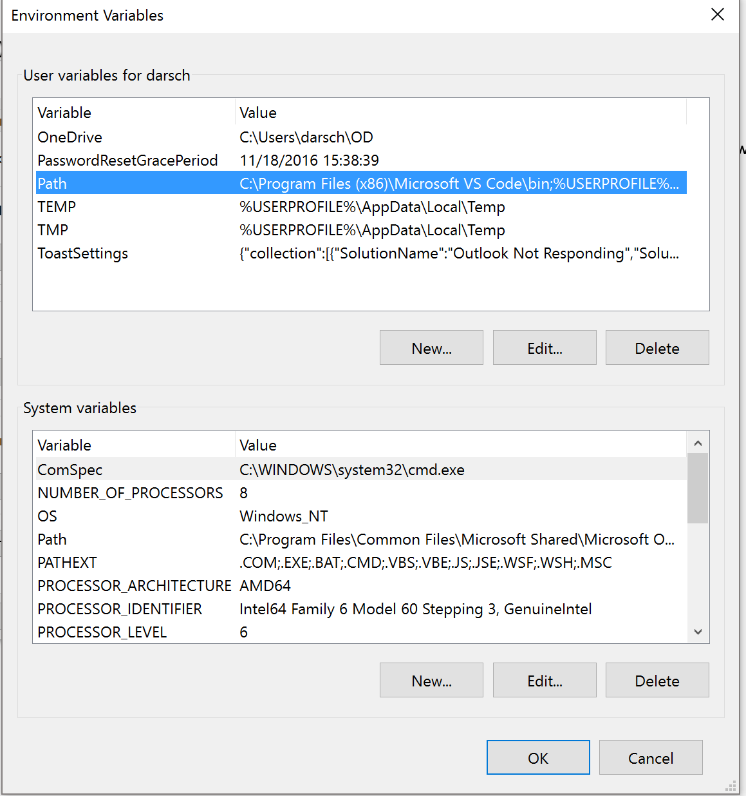
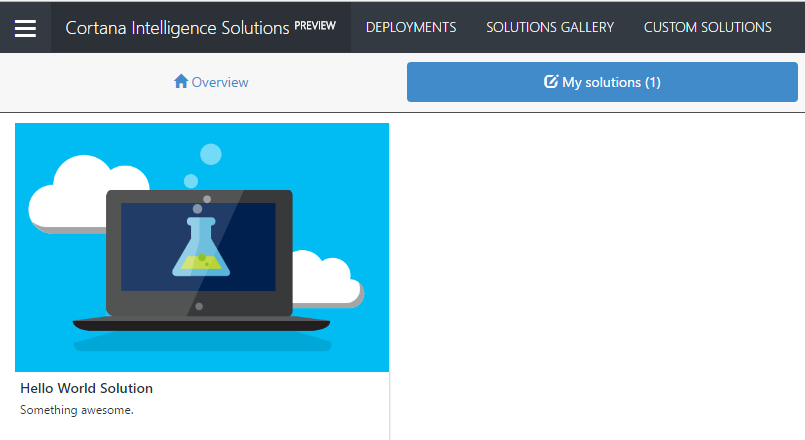

# Getting started

## SAW Web

### Known Issues and how to fix them:

#### Error when running saw deploy in SAW Web

Unhandled Exception: System.Reflection.TargetInvocationException: Exception has been thrown by the target of an invocation. ---> System.ArgumentNullException: Value cannot be null.
Parameter name: connectionString
   at Microsoft.WindowsAzure.Storage.CloudStorageAccount.Parse(String connectionString) in c:\Program Files (x86)\Jenkins\workspace\release_dotnet_master\Lib\Common\CloudStorageAccount.cs:line 486
   at Microsoft.Ciqs.Saw.Phases.SolutionDeployerPhase.set_SolutionStorageConnectionString(String value) in C:\work\saw\src\SawPhases\SolutionDeployerPhase.cs:line 31
   --- End of inner exception stack trace ---
... etc
   
#### How to fix    

Run the ``saw configure`` command from the SAW Web console.  The command is available to cut and paste (and click Enter) from CUSTOM SOLUTIONS > Setup and it should look something like this:

 

Example:

```saw configure -SolutionStorageConnectionString "DefaultEndpointsProtocol=https;AccountName=stgup88difkfhcjcj2;AccountKey=jhFT9xgQ86g766qMCrHejbMfnnaDlxzyt75EKXryl2Dc3145693f553HFq1QCitkVbfvYEEWF65mrURWOkuNGd66Q=="```

#### After fixing the error above you may get a 2nd error when running saw deploy in SAW Web

Unhandled Exception: System.IO.DirectoryNotFoundException: Could not find a part of the path 'D:\$Recycle.Bin\core'.
   at System.IO._Error.WinIOError(Int32 errorCode, String maybeFullPath)
   at System.IO.FileSystemEnumerableIterator 1.CommonInit()
   at System.IO.FileSystemEnumerableIterator 1..ctor(String path, String originalUserPath, String searchPattern, SearchOption searchOption, SearchResultHandler 1 resultHandler, Boolean checkHost)
... etc

#### How to fix    

Run the saw configure command from the SAW Web console. Cut and paste the following and click Enter.

```saw configure -SolutionDirectory "d:\home\saw\workspace\Solutions"```

## SAW Local (Windows only)
> **Alpha** version. It works, but the installer isn't signed, so expect some turbulence during the installation. Stable builds will be available soon.

[Download](https://ci.appveyor.com/project/wdecay/azure-cortanaintelligence-solutionauthoringworkspa/branch/master/artifacts) the latest build. Don't forget the configuration command from the Setup tab!

### How to Install SAW Local
* Download **SAW Local** from the link above and install

* This will add a **SAW Shell** shortcut to your desktop

   

* Double click on SAW Shell  

* To see if SAW is working enter ``saw help``

* Run the ``saw configure`` command from the SAW Shell console.  The command is available to cut and paste (and click Enter) from CUSTOM SOLUTIONS > Setup and it should look something like this:

    

   Example:

   ```saw configure -SolutionStorageConnectionString "DefaultEndpointsProtocol=https;AccountName=stgup88difkfhcjcj2;AccountKey=jhFT9xgQ86g766qMCrHejbMfnnaDlxzyt75EKXryl2Dc3145693f553HFq1QCitkVbfvYEEWF65mrURWOkuNGd66Q=="```

* SAW will now work to deploy solutions authored in any code editor

* If you want to run SAW from the command prompt and in the Visual Studio Code Terminal (Recommended) you need to add the path to SAW (**C:\Program Files (x86)\Microsoft\Solution Authoring Workspace**) to the Environment Variables in your Path in User Variables.

   You also need to add the path to MSBuild (**C:\Program Files (x86)\MSBuild\14.0\Bin**)
    
    Navigate to **Control Panel\System and Security\System** and click on **Advanced system settings**
    

* Click on **Environment Variables**

   

* Click on the Path variable under User variables and click on the **Edit** button

   

* Click on the **New** button and add the following path for SAW

    `` C:\Program Files (x86)\Microsoft\Solution Authoring Workspace``

	  Click on the **New** button and add the following path for MSBuild
    
    ``C:\Program Files (x86)\MSBuild\14.0\Bin``

   

* Then click the **OK** button  

   

* Open a Command Prompt and enter ``saw help``
  
    You should see the same info as you noticed in SAW Shell

* Using either the **command prompt** or the **Visual Studio Code terminal** you should be able to use SAW 

##Start Authoring using Solution Authoring Workspace (SAW)
  
* Open Visual Studio Code and go to **File>Open Folder** and navigate to 
    ``C:\Users\ENTERALIAS\Documents\Solution Authoring Workspace`` and click **Select Folder**

    

* VS Code should look like this

    

* Copy 001-helloworld from **Samples** to **My Solutions** and rename it ``helloworld``

    

* Type **Ctrl+~** to bring up the terminal in VS Code

    

  
* Type ``saw deploy`` or just ``saw deploy -solutions helloworld``if you have more than one solution in My Solutions and just want to deploy **helloworld**

    

* You are now ready to deploy your [Custom Solutions](https://start.cortanaintelligence.com/CustomSolutions) in the Cortana Intelligence Solutions.

##>Deploy the Custom Solution

* When you open [Custom Solutions](https://start.cortanaintelligence.com/CustomSolutions) you should now see the helloworld custom solution available in My soltuion.

    

* Hover over the solution and click on **Deploy**

* This will bring up the **Create new deployment** page.  Give the deployment a name, choose a subscription and location, click **Create**

    

* If there are no further parameters needed the **Resources provisioning** begins.

    
    
* When the solution completes you get an instructions markdown that let you know what to do next.  In this case you just see hello world.

* If you plan to use Git for source control and Visual Studio Code for a code editor you will also want to:
      - [Download and Install Git](https://git-scm.com/downloads)
      - [Download and Install VS Code](https://code.visualstudio.com/download)
