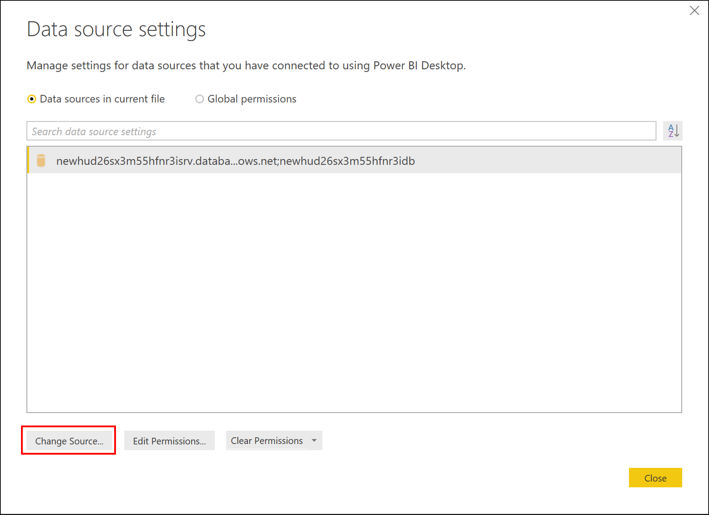
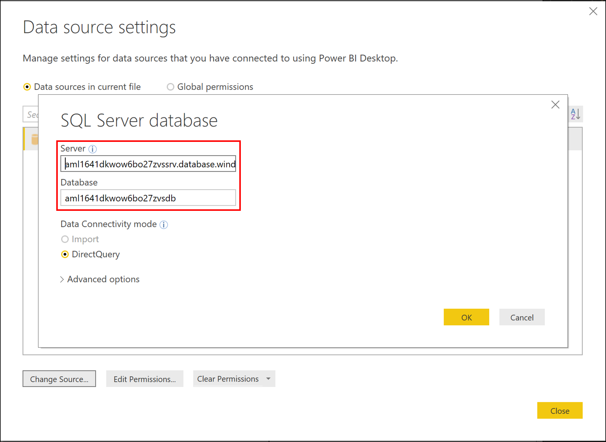
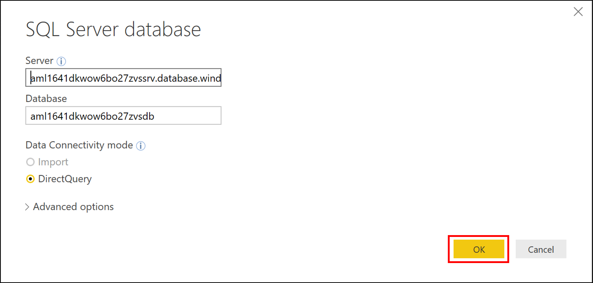
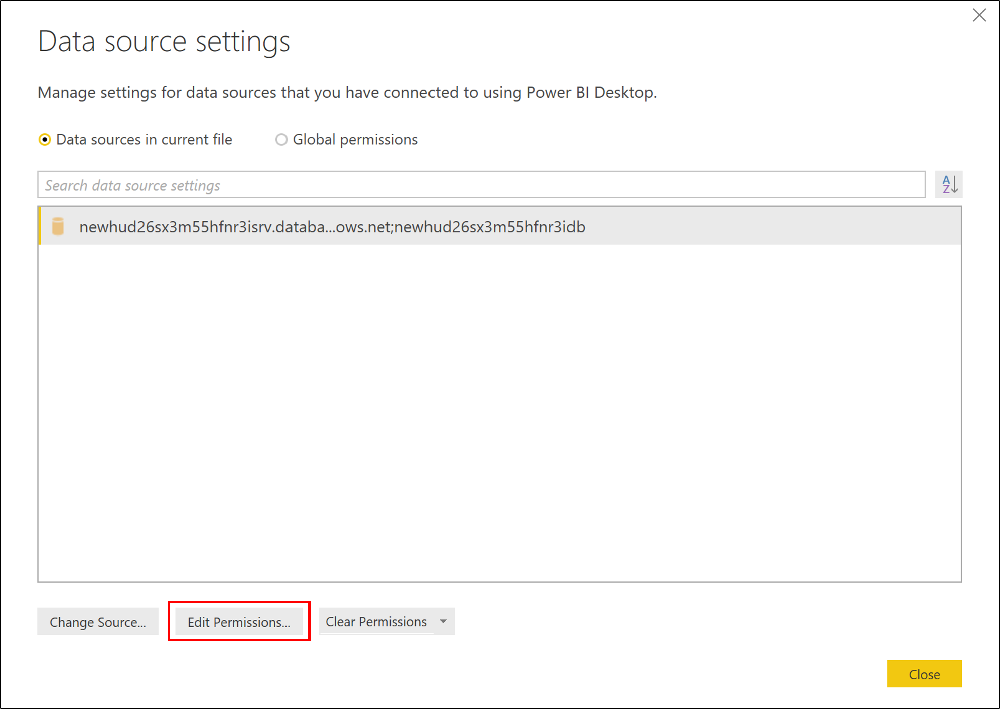
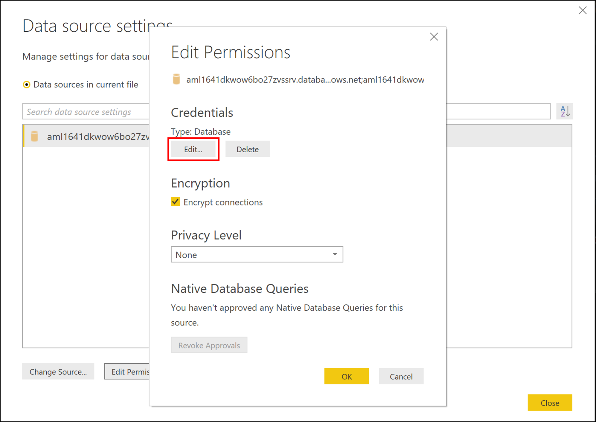
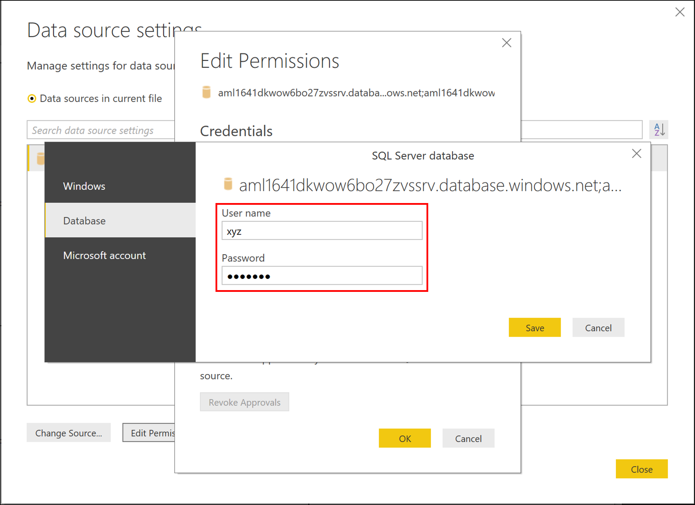
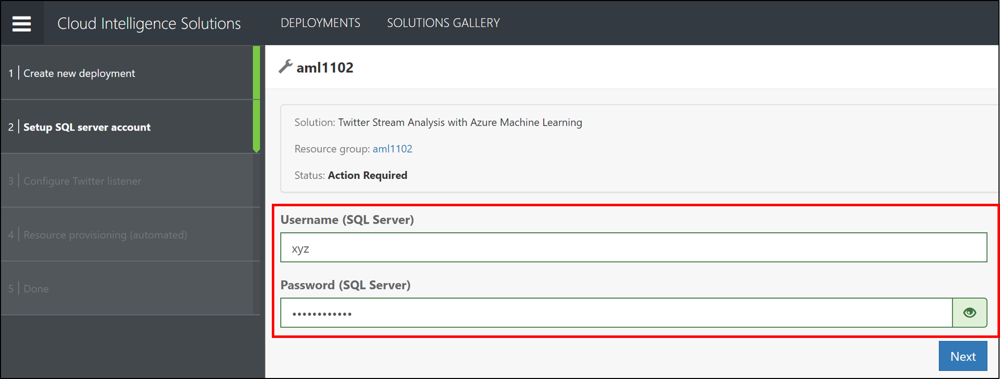
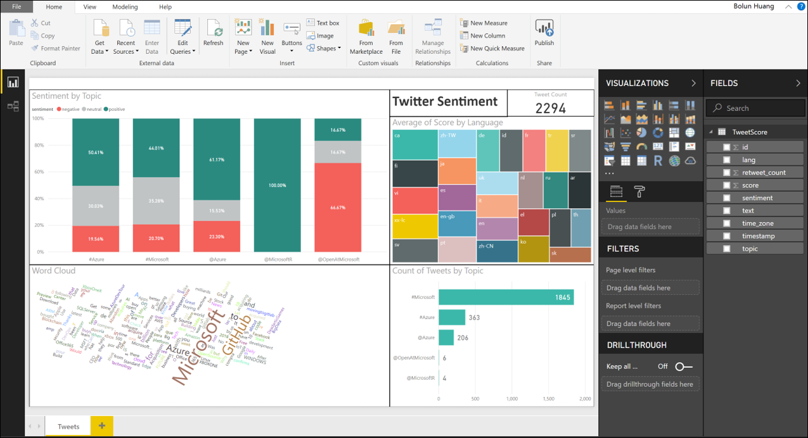

# How to connect to data source in Power BI desktop?
## Step 1
Download and open the sample **pbix** file. You can download Power BI desktop from [here](https://powerbi.microsoft.com/en-us/desktop/) to a Windows desktop if you don’t have one.
## Step 2
**Close** any prompted dialog if you are asked for data credential, because in this tutorial we are going to change the data source and credential away from default configuration to what you have just provisioned.
## Step 3
Click "**Edit Queries**" and select "**Data source settings**".

## Step 4
In the "**Data source settings**" dialog, choose the default data source as such, and click on "**Change source...**".

## Step 5
From the "**Change Source...**" popup, replace the "**Server**" and "**Database**" input as the post-deployment instruction tells and leave everything else as default. for example:

The "**Server**" name and "**Database**" name are usually displayed in the post-deployment instructions, for example:

## Step 6
Click "**OK**" to exit changing the data source.

## Step 7
Then we are ready to configure the credentials for the new data source we just added.
Navigate again to the data source settings dialog by clicking "**Edit Queries**", and then selecting "**Data source settings**" as in [**Step 3**](#step-3). This time click "**Edit Permissions...**" button.

## Step 8
In the "**Edit Permissions...**" popup, within the "**Credentials**" section, click the "**Edit...**" button.

## Step 9
From the "**Credentials**" popup, choose "**Database**" and type in the "**User name**" and "**Password” as instructed.

The "**User name**" and "**Password**" are the ones you were asked to provide in the middle of the provisioning workflow (Remember? 😊).

## Step 10
Click "**Save**" to finish configuring the "**Credentials**" and click "**OK**" to finish editing the permissions. Leave other settings as default and click "**Close**" to complete the "**Data source settings**".
## Step 11
Finally, click "Refresh" button or the "Apply changes" button to load data from the data source into your report; Power BI report views with real-time streaming data is ready for you!

You can always create your own custom views in Power BI reports. More details about Report View in Power BI desktop is available [**here**](https://docs.microsoft.com/en-us/power-bi/desktop-report-view).
Below is a sample output from [**Twitter Streaming with Azure Machine Learning**](https://gallery.azure.ai/Solution/Twitter-Stream-Analysis-with-Azure-Machine-Learning) solution template.

If you have any question or feedback, please [contact us](mailto:ciqsoncall@microsoft.com). Enjoy and have fun!
